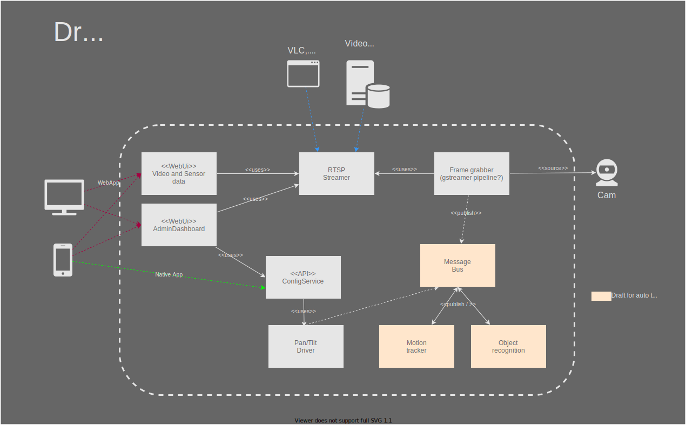

# Feature: Camera Panning (Draft)

In many cases where network cameras are used, the possibility to adjust the camera orientation via remote access is indispensable. In other applications it is desired that the camera monitors a larger area greater the field of view, or follows objects / people in motion to have them continuously in the picture.
 
ToDo: Simple UI Mock 
 
 

 

## User Stories:

|ID|Story Title|Description|
|:---|:---|:---|
| PAN-001 | Set Home Position | As a user, I want to be able to pan the camera manually, so that I can set the the default area to be monitored |
| PAN-002 | Set pan boundaries | As a user, I must be able to define the angle / boundaries in which the camera rotation should be possible, so the automatic object trancking is performed in the desired range |
|PAN-003|Display Video Feed| -|

 

### Functional Requirements
 

|ID|Label|Description|
|:---|:---|:---|
||||

 

### Rules

|ID|Label|Description|
|:---|:---|:---|
||||

 

ToDo: Acceptance Criteria / DoD?

 

### Open issues / challenges

- How to monitor that the cameara does not rotates over the max possible angel / range? 

### References

[Datasheet DRV8825](https://www.rototron.info/wp-content/uploads/PiStepper_DRV8825.pdf)
[Tutorial DRV8825 and RPi](https://www.rototron.info/raspberry-pi-stepper-motor-tutorial/)